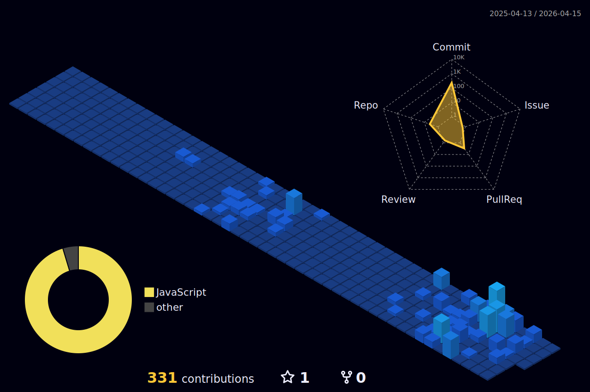

# Mark (RoRi) - Frontend Developer

<div align="center">


[](https://git.io/typing-svg)

</div>

## 🔥 About Me

```javascript
const rori = {
  name: "Mark Storchovyi",
  alias: "RoRi",
  location: "Poland, originally from Ukraine",
  role: "Frontend Developer",
  passion: "Creating beautiful and functional user interfaces",
  currentProject: "LioraLang",
  technologies: ["React", "TypeScript", "JavaScript", "Node.js"],
  hobbies: ["Coding", "Learning languages", "UI/UX Design", "Photography"],
  quote: "Code is like humor. When you have to explain it, it's bad."
};
```

## 🛠️ Tech Stack

### **Frontend**


### **Backend & Databases**


### **Tools & DevOps**


### **Design**


## 🚀 My Projects
### 🌟 **Main Project: [LioraLang](https://github.com/rorimark/LioraLang)**
[](https://github.com/rorimark/LioraLang)

**Technologies:** HTML, CSS, React, JavaScript, Node.js, SQLite, Electron, Vite

```javascript
const lioraLang = {
  features: [
    "Interactive dictionary",
    "Smart flashcards",
    "Progress tracking",
    "Responsive design",
    "Offline mode"
  ],
  status: "🚧 Active Development",
  stars: "⭐ Growing every day"
};
```

## 📊 GitHub Statistics

<div align="center">



</div>

## 🏆 LeetCode Achievements

[](https://leetcode.com/rorimark)

## 📈 Daily Activity

```text
🌅 Morning           ███████░░░░░░░░░░░░░ 35%   Code review, planning
🌞 Day               ██████████████░░░░░░ 65%   Active development
🌆 Evening           █████████░░░░░░░░░░░ 45%   Learning new technologies
🌙 Night             ████░░░░░░░░░░░░░░░░ 20%   Creating READMEs 😉

📊 Productivity      █████████████████░░░ 85%   Above average efficiency
💡 Ideas             ████████████████████ 100%  Constantly generating new ones
```

## 🎯 My Development Principles

```yaml
code_quality:
  - "Clean code comes first"
  - "DRY (Don't Repeat Yourself)"
  - "KISS (Keep It Simple, Stupid)"
  - "YAGNI (You Aren't Gonna Need It)"

development:
  - "Testing is not optional"
  - "Documentation is a developer's best friend"
  - "Code Review - learning from each other"
  - "Continuous learning - key to success"

design:
  - "User-centric approach"
  - "Minimalism and functionality"
  - "Responsive for all devices"
  - "Accessibility for everyone"
```

## 📫 Connect With Me

<div align="center">

[](https://linkedin.com/in/mark-storchovyi)
[](https://leetcode.com/rorimark)
[](https://github.com/rorimark)
[](mailto:markstorchovyi@gmail.com)
[](https://t.me/rori_mark)

</div>

</details>

<details>
<summary><b>📚 Currently Learning</b></summary>

```javascript
const currentlyLearning = {
  languages: ["TypeScript", "Rust", "PHP"],
  frameworks: ["React", "React Native"],
  technologies: ["GraphQL", "WebSockets", "WebRTC"],
  concepts: ["Micro-frontends", "Clean Architecture", "TDD/BDD"],
  tools: ["Docker", "AWS/GCP", "CI/CD"]
};
```

</details>

## 🎨 My Coding Philosophy

```ascii
  ██████╗ ██████╗ ██████╗ ██╗███╗   ██╗ ██████╗ 
 ██╔════╝██╔═══██╗██╔══██╗██║████╗  ██║██╔════╝ 
 ██║     ██║   ██║██████╔╝██║██╔██╗ ██║██║  ███╗
 ██║     ██║   ██║██╔══██╗██║██║╚██╗██║██║   ██║
 ╚██████╗╚██████╔╝██║  ██║██║██║ ╚████║╚██████╔╝
  ╚═════╝ ╚═════╝ ╚═╝  ╚═╝╚═╝╚═╝  ╚═══╝ ╚═════╝ 
  
Code is not just instructions for a computer.
It's art, science, and a way of thinking.
```

---

<div align="center">

### ⚡ **Final Thought**

> "A good developer writes code that works. A great developer writes code that is clear, maintainable, and inspires others."

**🚀 Thanks for visiting my profile! See you in the code!** 🚀


</div>
