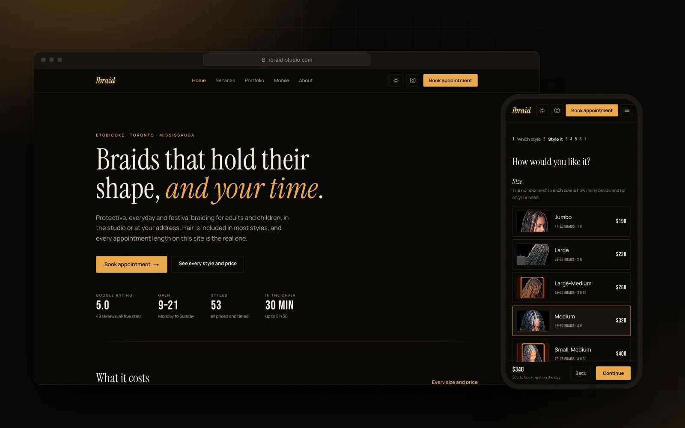
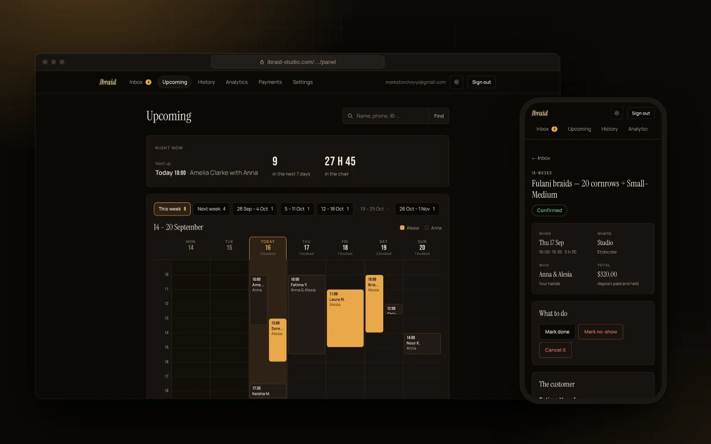
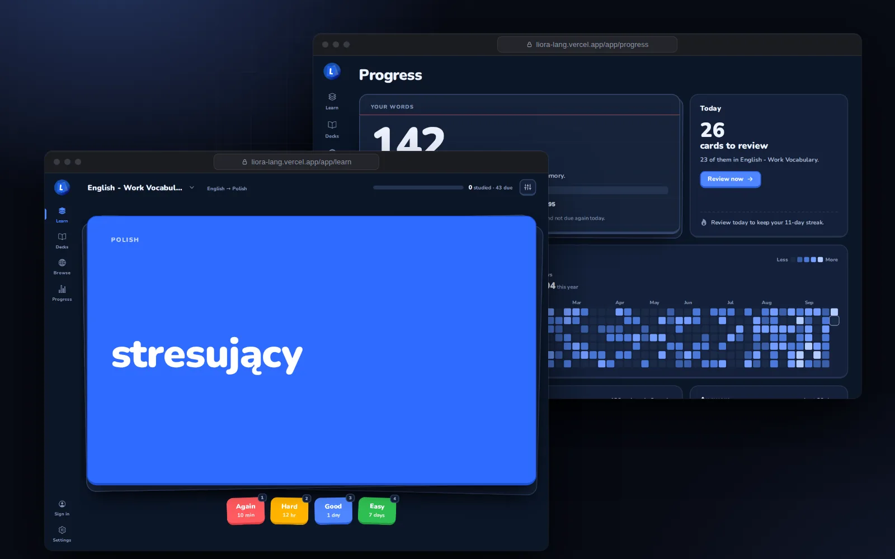

<h2 align="center">Hi, I'm Mark 👋</h2>

  Frontend developer · <b>React, Next.js, TypeScript</b> · Wrocław, open to remote

  
  
  

  

### iBraid Studio

Website, online booking and studio panel for a braiding studio in Toronto. Built solo, in production.
**~50 clients a month · 53 services · Stripe deposits · 700+ tests**
[Live site](https://www.ibraid-studio.com) · [Case study](https://mark-storchovyi.com/#case-study)

<table>
  <tr>
    <td width="50%" valign="top">
      
       <b>iBraid Studio panel</b>
       Bookings, weekly calendar, payments and analytics. Confirm a request from Telegram in one tap.
    </td>
    <td width="50%" valign="top">
      
       <b><a href="https://github.com/rorimark/LioraLang">LioraLang</a></b>
       Offline flashcards with spaced repetition, on the web and on desktop. <a href="https://liora-lang.vercel.app">Try it</a>
    </td>
  </tr>
</table>
